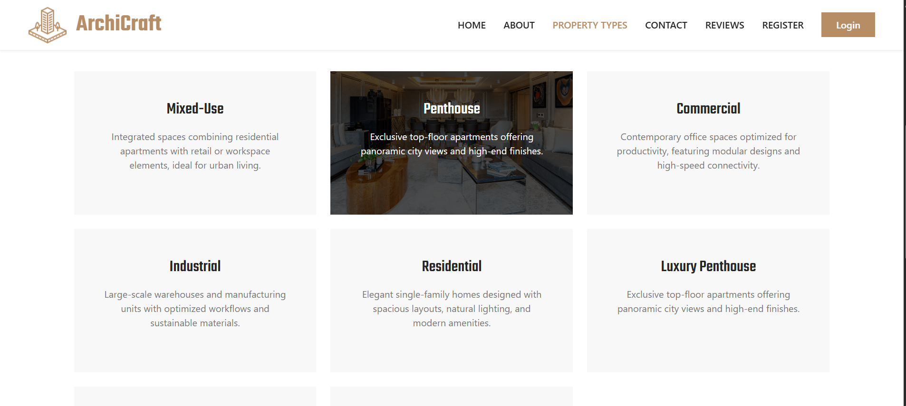

# 🏗️ ArchiCraft

**ArchiCraft** is a full-stack web application built using **React** and **Firebase**. It enables customers to order custom architectural designs and allows admins to manage users, orders, and property types. The app ensures a seamless workflow between architects and clients.

---

## 📌 Features

### 👤 Customer Panel

- Register/Login with email
- View available property types (Residential, Commercial, etc.)
- Place custom design orders
- Upload property images and requirements
- Track order status
- Submit reviews after project completion
- Update personal profile information

### 🛠️ Admin Panel

- Admin Dashboard with real-time stats
- Manage Customers (View, Block/Unblock)
- Manage Property Types (Add, Update, Delete)
- Manage Orders (Change status, add final design map)
- Manage Reviews (View, Delete inappropriate content)

---

## 🔐 Authentication

- Firebase Authentication (Email/Password)
- Role-based access control (Admin, Customer)

---

## 🧱 Tech Stack

| Layer          | Technology         |
| -------------- | ------------------ |
| Frontend       | React              |
| Database       | Firebase Firestore |
| Authentication | Firebase Auth      |
| Hosting        | Firebase Hosting   |

---

## 📂 Folder Structure

/src
├── components
│ ├── admin/
│ ├── customer/
├── context/
├── pages/
├── utils/
├── App.js
└── index.js

---

## 🗃️ Firebase Collections

### `users`

- `id`, `name`, `email`, `contact`, `userType`, `createdAt`, `status`

### `propertyTypes`

- `id`, `name`, `description`, `image`, `status`, `createdAt`

### `orders`

- `id`, `userId`, `userName`, `propertyTypeId`, `propertyTypeName`, `dimensions`, `description`, `image`, `finalAttachment`, `status`, `totalPrice`, `paymentStatus`, `createdAt`

### `reviews`

- `id`, `orderId`, `userId`, `userName`, `rating`, `comment`, `createdAt`, `status`

---

### 🖼️ Project Screenshots

## Customer Panel & Admin Panel

  
  
   
  
  

## 🚀 Getting Started

## 1. Clone the Repository

git clone https://github.com/NikitaSain20/Archicraft-React-Firebase.git
cd Archicraft-React-Firebase

## 2.Install Dependencies

npm install

## 3.Add Firebase Config

Create a .env file in the root directory:

REACT_APP_FIREBASE_API_KEY=your_key
REACT_APP_FIREBASE_AUTH_DOMAIN=your_project.firebaseapp.com
REACT_APP_FIREBASE_PROJECT_ID=your_project
REACT_APP_FIREBASE_STORAGE_BUCKET=your_project.appspot.com
REACT_APP_FIREBASE_MESSAGING_SENDER_ID=your_id
REACT_APP_FIREBASE_APP_ID=your_id

## 4.Start the App

npm start

### 🧾 How to Use

Customers can explore property types, place orders, and track progress from their dashboard.

Admins can view overall stats, manage all content (users, orders, reviews), and send final designs.

---

### ✍️ Author

 

Developed by Nikita Sain
